# Database Schema — Busy Hour Prediction (Updated)

## Database

**MySQL** — karena project kasir ini pakai **Laravel**, MySQL paling natural.

---

## Tabel yang Dibutuhkan

Dari return data endpoint `POST /api/predict/busy-hours`, kamu butuh **4 tabel**:

```mermaid
erDiagram
    busy_hour_forecasts ||--o{ busy_hour_daily_forecasts : "has many"
    busy_hour_daily_forecasts ||--o{ busy_hour_hourly_predictions : "has many"
    busy_hour_hourly_predictions ||--o{ busy_hour_product_predictions : "has many"

    busy_hour_forecasts {
        bigint id PK
        int user_id FK
        datetime analysis_date
        int forecast_days
        float accuracy_percent
        int training_samples
        date data_range_from
        date data_range_to
        string busiest_day
        string quietest_day
        float avg_daily_transactions
        float avg_daily_revenue
        int total_peak_hours
        json top_peak_hours
        timestamps created_at
    }

    busy_hour_daily_forecasts {
        bigint id PK
        bigint forecast_id FK
        date forecast_date
        string day_name
        int day_of_week
        boolean is_weekend
        float total_predicted_trx
        float total_predicted_revenue
        string peak_hour
        float peak_hour_trx
        int busy_hours_count
        timestamps created_at
    }

    busy_hour_hourly_predictions {
        bigint id PK
        bigint daily_forecast_id FK
        string hour
        float predicted_transactions
        float predicted_revenue
        string busy_level
        string emoji
        timestamps created_at
    }

    busy_hour_product_predictions {
        bigint id PK
        bigint hourly_prediction_id FK
        int product_id
        string product_name
        float probability
        float estimated_qty
        float estimated_revenue
        timestamps created_at
    }
```



---

## Detail Per Tabel

### 1. `busy_hour_forecasts` — Master forecast session

> 1 record setiap kali user menjalankan prediksi.

| Column | Type | Dari Response |
|--------|------|---------------|
| `id` | BIGINT PK | auto |
| `user_id` | BIGINT FK → users | dari auth |
| `analysis_date` | DATETIME | `analysis_date` |
| `forecast_days` | INT | `forecast_days` |
| `accuracy_percent` | DECIMAL(5,2) | `accuracy_percent` |
| `training_samples` | INT | `training_samples` |
| `data_range_from` | DATE | `data_range.from` |
| `data_range_to` | DATE | `data_range.to` |
| `busiest_day` | VARCHAR(50) | `busiest_day` |
| `quietest_day` | VARCHAR(50) | `quietest_day` |
| `avg_daily_transactions` | DECIMAL(10,2) | `avg_daily_transactions` |
| `avg_daily_revenue` | DECIMAL(15,2) | `avg_daily_revenue` |
| `total_peak_hours` | INT | `total_peak_hours` |
| `top_peak_hours` | JSON | `top_peak_hours` |
| `created_at` | TIMESTAMP | auto |
| `updated_at` | TIMESTAMP | auto |

### 2. `busy_hour_daily_forecasts` — Prediksi per hari

> 14 records per forecast (1 per hari yang diprediksi).

| Column | Type | Dari Response |
|--------|------|---------------|
| `id` | BIGINT PK | auto |
| `forecast_id` | BIGINT FK → busy_hour_forecasts | relasi |
| `forecast_date` | DATE | `daily_forecasts[].date` |
| `day_name` | VARCHAR(20) | `daily_forecasts[].day_name` |
| `day_of_week` | TINYINT | `daily_forecasts[].day_of_week` |
| `is_weekend` | BOOLEAN | `daily_forecasts[].is_weekend` |
| `total_predicted_trx` | DECIMAL(10,2) | `daily_forecasts[].total_predicted_transactions` |
| `total_predicted_revenue` | DECIMAL(15,2) | `daily_forecasts[].total_predicted_revenue` |
| `peak_hour` | VARCHAR(10) | `daily_forecasts[].peak_hour` |
| `peak_hour_trx` | DECIMAL(10,2) | `daily_forecasts[].peak_hour_transactions` |
| `busy_hours_count` | INT | `daily_forecasts[].busy_hours_count` |

### 3. `busy_hour_hourly_predictions` — Prediksi per jam

> ~14 records per daily forecast (07:00-20:00).
> Total: ~196 records per forecast session.

| Column | Type | Dari Response |
|--------|------|---------------|
| `id` | BIGINT PK | auto |
| `daily_forecast_id` | BIGINT FK → busy_hour_daily_forecasts | relasi |
| `hour` | VARCHAR(10) | `hourly_breakdown[].hour` |
| `predicted_transactions` | DECIMAL(10,2) | `hourly_breakdown[].predicted_transactions` |
| `predicted_revenue` | DECIMAL(15,2) | `hourly_breakdown[].predicted_revenue` |
| `busy_level` | ENUM('PEAK','HIGH','MEDIUM','LOW','CLOSED') | `hourly_breakdown[].busy_level` |
| `emoji` | VARCHAR(10) | `hourly_breakdown[].emoji` |

### 4. `busy_hour_product_predictions` — Prediksi produk per jam

> ~3-6 records per hourly prediction.
> Total: ~600-1200 records per forecast session.

| Column | Type | Dari Response |
|--------|------|---------------|
| `id` | BIGINT PK | auto |
| `hourly_prediction_id` | BIGINT FK → busy_hour_hourly_predictions | relasi |
| `product_id` | INT FK → products | `predicted_products[].product_id` |
| `product_name` | VARCHAR(255) | `predicted_products[].product_name` |
| `probability` | DECIMAL(5,3) | `predicted_products[].probability` |
| `estimated_qty` | DECIMAL(10,1) | `predicted_products[].estimated_qty` |
| `estimated_revenue` | DECIMAL(15,2) | `predicted_products[].estimated_revenue` |

---

## Volume Estimate Per 1x Predict

| Tabel | Records |
|-------|---------|
| `busy_hour_forecasts` | 1 |
| `busy_hour_daily_forecasts` | 14 |
| `busy_hour_hourly_predictions` | ~196 |
| `busy_hour_product_predictions` | ~800 |
| **Total** | **~1,011 records** |

---

## Laravel Migration (MySQL)

```php
// 1. busy_hour_forecasts
Schema::create('busy_hour_forecasts', function (Blueprint $table) {
    $table->id();
    $table->foreignId('user_id')->constrained();
    $table->dateTime('analysis_date');
    $table->integer('forecast_days');
    $table->decimal('accuracy_percent', 5, 2);
    $table->integer('training_samples');
    $table->date('data_range_from');
    $table->date('data_range_to');
    $table->string('busiest_day', 50);
    $table->string('quietest_day', 50);
    $table->decimal('avg_daily_transactions', 10, 2);
    $table->decimal('avg_daily_revenue', 15, 2);
    $table->integer('total_peak_hours');
    $table->json('top_peak_hours');
    $table->timestamps();
});

// 2. busy_hour_daily_forecasts
Schema::create('busy_hour_daily_forecasts', function (Blueprint $table) {
    $table->id();
    $table->foreignId('forecast_id')->constrained('busy_hour_forecasts')->cascadeOnDelete();
    $table->date('forecast_date');
    $table->string('day_name', 20);
    $table->tinyInteger('day_of_week');
    $table->boolean('is_weekend');
    $table->decimal('total_predicted_trx', 10, 2);
    $table->decimal('total_predicted_revenue', 15, 2);
    $table->string('peak_hour', 10);
    $table->decimal('peak_hour_trx', 10, 2);
    $table->integer('busy_hours_count');
    $table->timestamps();
});

// 3. busy_hour_hourly_predictions
Schema::create('busy_hour_hourly_predictions', function (Blueprint $table) {
    $table->id();
    $table->foreignId('daily_forecast_id')->constrained('busy_hour_daily_forecasts')->cascadeOnDelete();
    $table->string('hour', 10);
    $table->decimal('predicted_transactions', 10, 2);
    $table->decimal('predicted_revenue', 15, 2);
    $table->enum('busy_level', ['PEAK', 'HIGH', 'MEDIUM', 'LOW', 'CLOSED']);
    $table->string('emoji', 10);
    $table->timestamps();
});

// 4. busy_hour_product_predictions
Schema::create('busy_hour_product_predictions', function (Blueprint $table) {
    $table->id();
    $table->foreignId('hourly_prediction_id')->constrained('busy_hour_hourly_predictions')->cascadeOnDelete();
    $table->unsignedBigInteger('product_id');
    $table->string('product_name');
    $table->decimal('probability', 5, 3);
    $table->decimal('estimated_qty', 10, 1);
    $table->decimal('estimated_revenue', 15, 2);
    $table->timestamps();

    $table->foreign('product_id')->references('id')->on('products');
});
```

> [!TIP]
> Semua child table pakai `cascadeOnDelete()` — kalau forecast dihapus, semua data turunannya ikut terhapus otomatis.

> [!IMPORTANT]
> `top_peak_hours` disimpan sebagai JSON karena datanya bersifat snapshot yang jarang di-query individual. Sisanya semua sudah di-normalize ke kolom biasa.

---

## Mapping Response → Tabel

```
Response JSON                          → Tabel
─────────────────────────────────────────────────────
analysis_date                          → busy_hour_forecasts.analysis_date
forecast_days                          → busy_hour_forecasts.forecast_days
accuracy_percent                       → busy_hour_forecasts.accuracy_percent
training_samples                       → busy_hour_forecasts.training_samples
data_range.from                        → busy_hour_forecasts.data_range_from
data_range.to                          → busy_hour_forecasts.data_range_to
busiest_day                            → busy_hour_forecasts.busiest_day
quietest_day                           → busy_hour_forecasts.quietest_day
avg_daily_transactions                 → busy_hour_forecasts.avg_daily_transactions
avg_daily_revenue                      → busy_hour_forecasts.avg_daily_revenue
total_peak_hours                       → busy_hour_forecasts.total_peak_hours
top_peak_hours                         → busy_hour_forecasts.top_peak_hours (JSON)
daily_forecasts[]                      → busy_hour_daily_forecasts
daily_forecasts[].hourly_breakdown[]   → busy_hour_hourly_predictions
hourly_breakdown[].predicted_products[]→ busy_hour_product_predictions
```
